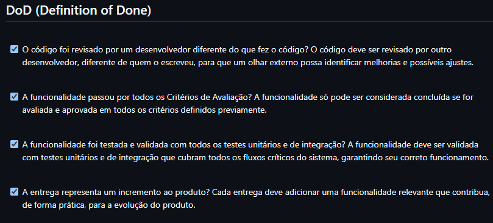

## Declaração

### Refinamento final das US

O refinamento final das US's ocorreu após a finalização do protótipo e da validação do cliente sobre o mesmo. A partir disso, foi decidido que algumas alterações aconteceriam no [backlog no projeto Gestão VSM](../visao_prod_proj/backlog_produto.md), entre elas estão as seguintes:

**US21 -** Como cliente, quero receber uma confirmação automática do agendamento via WhatsApp, para ter certeza de que meu horário foi reservado corretamente.

- **Versão Antiga:** "Como chatbot, eu quero enviar uma confirmação automática do agendamento no WhatsApp do cliente, para que ele tenha certeza de que o horário foi reservado corretamente.;
- **Melhorias:** o ator foi indicado corretamente, a linguagem se tornou mais natural e houve a remoção da redundância presente na frase.

**US22 -** Como cliente, quero escolher o profissional desejado durante o agendamento no WhatsApp, para ser atendido por quem eu prefiro.

- **Versão Antiga:** "Como chatbot, eu quero dar a opção para o cliente escolher o profissional desejado, para que eu possa ser atendido por quem eu prefiro.";
- **Melhorias:** foi colocado maior foco no usuário final em vez do chatbot, além de uma ação direta e um contexto mais claro.

**US23 -** Como cliente, quero visualizar os horários disponíveis diretamente no WhatsApp, para escolher o melhor horário com rapidez.

- **Versão Antiga:** "Como chatbot, eu quero permitir meu cliente visualizar os horários disponíveis diretamente no chat, para que ele possa escolher rapidamente o melhor horário.";
- **Melhorias:** foi adicionada uma perspectiva do cliente como protagonista.

## Verificação e Validação

### Aplicação do DoD

A Definição de Feito (DoD) foi devidamente estruturada e utilizada durante o desenvolvimento da aplicação. Sendo que todas as US's do MVP passaram pela checklist e, a partir da sua validação completa, estavam aprovados e dados como feitos. Os critérios que eram utilizados pelo time para determinar quando uma entrega estava feita eram os seguintes:

Figura 1 - Definition of Done 

## Histórico de Versão

|Data|Versão|Descrição|Autor|
|---|---|---|---|
| 11/05/2025| 1.0 | Criação do documento | [Weverton Rodrigues](https://github.com/vevetin) |
|15/07/2025|1.1|Atualização do Documento|[Vinícius Rufino](https://github.com/RufinoVfR)|