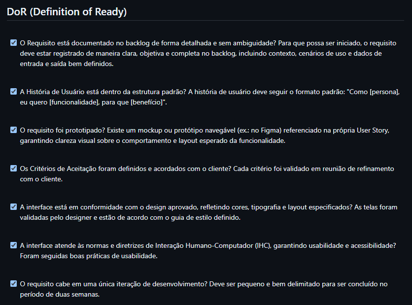
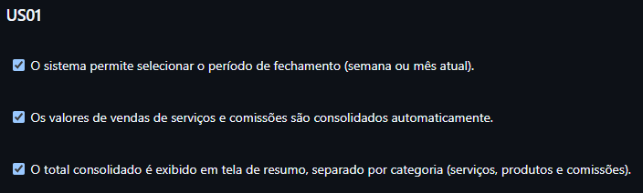
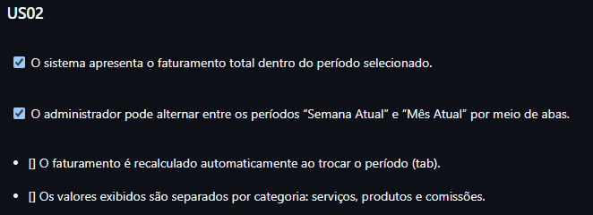
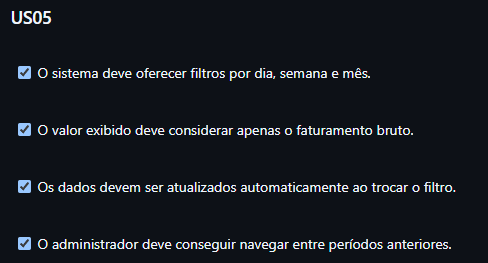
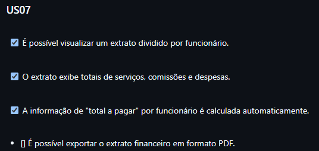
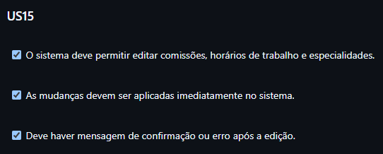
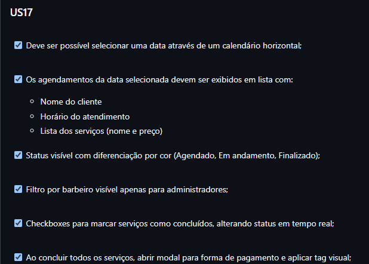
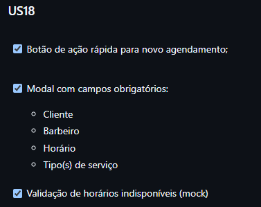

## Elicitação e Descoberta

### Entrevistas Complementares

Durante o desenvolvimento do projeto, tivemos reuniões com o cliente em que foram apresentados novos requisitos e atualizações sobre a barbearia e seus membros. Por conta do nossa facilidade de contato, tivemos o cliente bastante presente durante a fase de elaboração, o que fez com que nós frequentemente fossemos avisados de algum detalhe importante do sistema de gestão interna que eles usam e também que tivessemos sempre o Valder a disposição na hora de tirar uma dúvida. 

## Análise e Consenso

### Análise Custo-Benefício (B x 2 + U - E - R - D)

A priorização dos requisitos na fase de Elaboração do projeto Gestão VSM foi realizada por meio da aplicação da Análise Custo-Benefício, utilizando os critérios de Benefício (B), Urgência (U), Esforço (E), Risco (R) e Dependência (D). Essa metodologia, fundamentada na fórmula (B × 2 + U) − (E + R + D), permitiu estabelecer uma ordenação objetiva e estratégica dos itens do backlog, destacando aqueles que oferecem maior valor ao sistema com menor complexidade e risco de implementação. Para uma compreensão detalhada dos critérios e do processo de priorização adotado, consulte a página específica sobre [Priorização do Backlog Geral](../visao_prod_proj/backlog_produto.md#92-priorização-do-backlog-geral).

### Análise de Risco
<!-- adicionar algum registro -->

## Declaração

### Refinamento de User Stories

Durante o processo de Elabolação, foi alterada a **US 07** - Como administrador, quero acessar um extrato financeiro geral com divisão por funcionário, contendo serviços realizados, comissões e total a pagar por período, para acompanhar o desempenho da equipe e calcular repasses corretamente, que foi melhorada, no intuito de alinhá-la com o seu devido Requisito Funcional, trazer uma maior precisão nos dados, maior foco no objetivo financeiro e uma linguagem mais técnica. 

## Verificação e Validação

### Definition of Ready (DoR)

Com o intuito de garantir que as User Stories estejam completas, compreensíveis e prontas antes de passarem ao User Design, é feito um checklist para validar se elas estão prontas para serem iniciadas. Esse checklist é o DoR, e esteve presente antes do desenvolvimento de todas as User Stories desse projeto. A evidência do DoR está representada por meio do print a seguir:

Figura 1 - Definition of Ready 

### Critérios de Aceitação

Já os Critérios de Aceitação, que servem para validar a entrega de uma User Story, também foram representados pela equipe e estão disponíveis a seguir:

**US 01 ** - Como administrador, eu quero realizar o fechamento de caixa com base na consolidação automática das receitas e comissões do período para que eu possa encerrar o dia de trabalho com segurança e sem erros manuais.

Figura 2 - Critérios de Aceitação US 01 

**US 02** - Como administrador, eu quero calcular e visualizar o faturamento total da barbearia em um intervalo de datas, com filtros para funcionário para que eu possa acompanhar o desempenho financeiro do negócio de forma abrangente.

Figura 3 - Critérios de Aceitação US 02 

**US 05** - Como administrador, eu quero visualizar o valor bruto do faturamento com detalhamento diário, semanal ou mensal para que eu possa acompanhar a saúde financeira da barbearia em diferentes escalas de tempo.

Figura 4 - Critérios de Aceitação US 05 

**US 07** - Como administrador, quero acessar um extrato financeiro geral com divisão por funcionário, contendo serviços realizados, comissões e total a pagar por período, para acompanhar o desempenho da equipe e calcular repasses corretamente.

Figura 5 - Critérios de Aceitação US 07 

**US 15** - Como administrador, eu quero editar dados dos funcionários, incluindo comissões, horários e especialidades para que eu possa manter os dados da equipe sempre atualizados conforme mudanças operacionais.

Figura 6 - Critérios de Aceitação US 15 

**US 17** - Como administrador ou barbeiro, eu quero visualizar o calendário com os agendamentos filtrados por data, cliente e duração para que eu possa planejar melhor os atendimentos e acompanhar a rotina de trabalho.

Figura 7 - Critérios de Aceitação US 17 

**US 18** - Como administrador ou barbeiro, eu quero adicionar serviços ao calendário do barbeiro responsável para que eu possa organizar os atendimentos de acordo com a disponibilidade do profissional.

Figura 8 - Critérios de Aceitação US 18 

## Organização e Atualização

### DEEP contínuo
<!-- adicionar algum registro -->

### Repriorizações
<!-- adicionar algum registro -->

## Histórico de Versão

|Data|Versão|Descrição|Autor|
|---|---|---|---|
| 11/05/2025| 1.0 | Criação do documento | [Weverton Rodrigues](https://github.com/vevetin) |
| 15/07/2025| 1.1 | Atualização do documento | [Vinícius Rufino](https://github.com/RufinoVfR) |