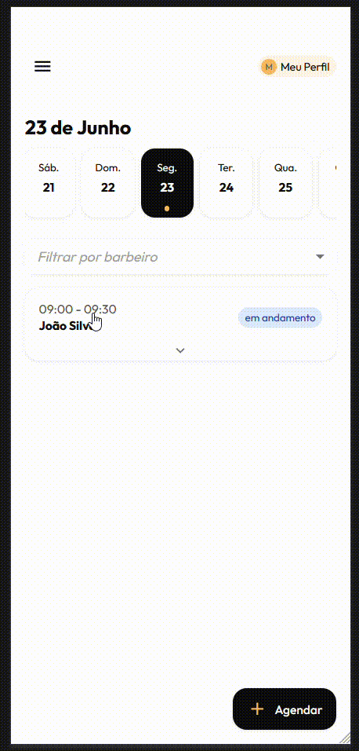
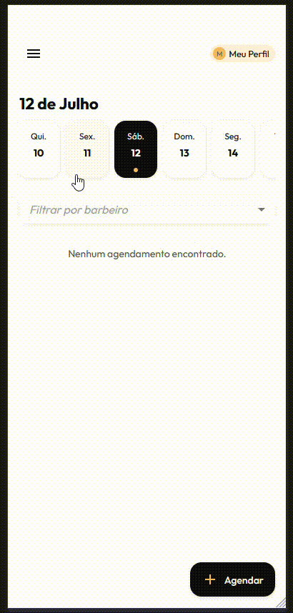

## Representação

### Mockups

Durante o início da fase de User Design, a equipe produziu mockups em baixa e média fidelidade utilizando a ferramenta Excalidraw, por sua leveza, foco na estrutura e agilidade na iteração. Esses mockups foram utilizados para representar visualmente as ideias discutidas nas fases de concepção e elaboração, com o objetivo de transformar requisitos abstratos em estruturas tangíveis, facilitando a comunicação entre a equipe e o cliente.

Figura 1 - Conjunto de mockups principais elaborados no Excalidraw

Os mockups incluíram telas como agendamento de clientes, fechamento de caixa, visualização de extratos e fluxo de navegação básico do sistema. Cada esboço foi pensado para representar a organização da informação, disposição dos elementos principais e fluxo esperado de interação. Foram exploradas opções de layout, agrupamento de ações, menus e chamadas para ações principais.

A aplicação dos mockups foi fundamental para antecipar dúvidas e para o alinhamento visual inicial. Eles foram apresentados em reuniões presenciais e discutidos com o cliente em tempo real, permitindo que feedbacks fossem registrados de forma imediata. A simplicidade da ferramenta também facilitou a colaboração durante os encontros, com ajustes feitos diretamente sobre os esboços.

Essa etapa também teve impacto direto na fase de análise e consenso da Engenharia de Requisitos: ao visualizar os mockups, tanto cliente quanto a equipe foram capazes de identificar elementos ausentes ou mal compreendidos, o que levou à criação e reformulação de algumas User Stories e critérios de aceitação.

### Protótipos de Alta Fidelidade

Com base nos fluxos validados pelos mockups, a equipe desenvolveu protótipos de alta fidelidade diretamente em HTML, CSS e React, simulando a navegação do sistema sem integração com backend. Essa abordagem permitiu validar a interface e a usabilidade, além de possibilitar o reaproveitamento parcial do código na fase de construção, reduzindo retrabalho.

Os protótipos foram estruturados como uma aplicação front-end navegável, incluindo telas como agenda interativa, visualização de faturamento diário, extrato por funcionário e cadastros simulados. Durante reuniões de demonstração, a navegação em tempo real possibilitou a coleta imediata de feedback do cliente, gerando ajustes como reorganização de campos, reposicionamento de botões e redesenho de hierarquias de informação.

O desenvolvimento seguiu princípios de design centrado no usuário, fundamentados nas práticas recomendadas por Barbosa e Silva (2021)[1] e nas diretrizes do Material Design 3[2], que orientaram a identidade visual e o guia de estilo, assegurando consistência no produto. 

| [{ style="width: 100%; max-width: 230px;" }](./assets/prototipo-agendamento.gif) | [{ style="width: 100%; max-width: 230px;" }](./assets/prototipo-fechamento.gif) |
|:--:|:--:|

## Declaração

### Criação/refinamento de US com base em feedback

## Verificação e Validação

### Feedback com o cliente

## Organização e Atualização

### Repriorização do Backlog

## Referências Bibliográficas

- [1] BARBOSA, Simone; SILVA, Bruno. Interação Humano-Computador e Experiência do Usuário. 1. ed. Rio de Janeiro: Elsevier, 2021.

- [2] GOOGLE. Material Design 3. Disponível em: https://m3.material.io. Acesso em: [data de acesso].

## Histórico de Versão

|Data|Versão|Descrição|Autor|
|---|---|---|---|
| 11/05/2025| 1.0 | Criação do documento | [Weverton Rodrigues](https://github.com/vevetin) |