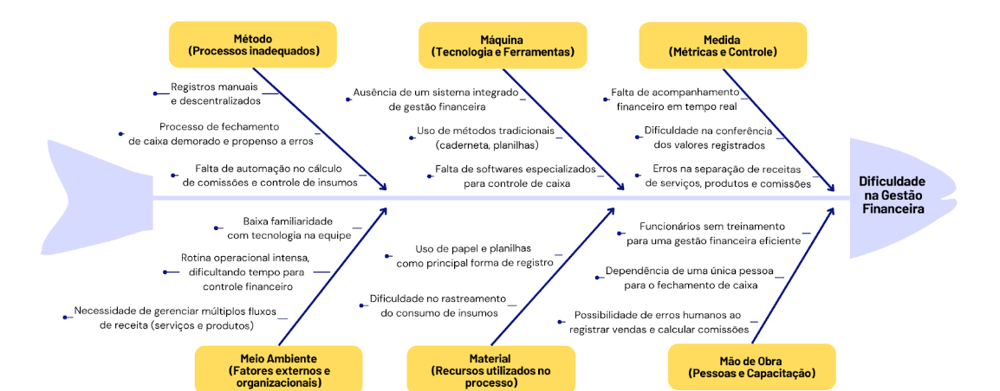

# Visão de Produto e Projeto

## Cenário Atual do Cliente e do Negócio

### Introdução ao Negócio e Contexto

A VSM é uma barbearia localizada em Rio Branco, Acre, com sete anos de atuação no mercado. Sob a gestão de Valder, o estabelecimento conta com uma equipe de cinco funcionários e oferece serviços especializados em cortes de cabelo e barbas, além da venda de produtos para cuidados pessoais.
Seu público-alvo é predominantemente masculino, abrangendo clientes de diversas faixas etárias, desde crianças até idosos. Com uma clientela fiel e consolidada, a barbearia busca aprimorar sua gestão interna para tornar seus processos mais eficientes e melhorar a administração do negócio.

### Identificação da Oportunidade ou Problema

Atualmente, a gestão financeira das barbearias, especialmente o fechamento de caixa, representa um grande desafio. Além dos serviços prestados, como cortes e barbas, a venda de produtos agrega complexidade ao controle financeiro. O uso de métodos manuais para registrar transações resulta em inconsistências, dificultando a conferência de valores e aumentando o risco de erros.
O cálculo do faturamento diário envolve diversos fatores, como serviços realizados, vendas de produtos, custos com insumos e comissões dos funcionários, tornando o processo ainda mais desafiador.
Diante desse cenário, este projeto propõe o desenvolvimento de uma solução digital para automatizar cálculos financeiros, organizar registros de vendas e serviços e aprimorar o controle sobre insumos, proporcionando uma gestão mais eficiente e auxiliando na tomada de decisões estratégicas.
A seguir, o Diagrama de Ishikawa ilustra os principais fatores que contribuem para a dificuldade na gestão financeira e no fechamento de caixa da barbearia:

A Barbearia VSM enfrenta desafios operacionais significativos, especialmente no controle financeiro e na organização dos atendimentos. O fechamento de caixa é realizado manualmente ao final de cada semana, o que gera desorganização e dificulta a consulta dos registros diários de cada barbeiro, impactando a eficiência da gestão, além de demandar tempo e esforço, expondo a possíveis erros.
Esses desafios evidenciam a necessidade de uma solução digital que otimize a administração financeira e a organização interna da barbearia.

### Segmentação de Clientes

A solução será utilizada exclusivamente pela equipe da VSM, incluindo o proprietário e os funcionários da barbearia. Assim, os principais perfis de usuários do sistema podem ser segmentados da seguinte forma:
Proprietário/Gerente (37 anos): Responsável pela administração geral da barbearia, incluindo a gestão financeira e pagamento de comissões. Necessita de um sistema que forneça uma visão ampla e detalhada do faturamento, custos e desempenho do negócio;

Barbeiros/Funcionários (20-45 anos): Profissionais que realizam os atendimentos e recebem comissões sobre os serviços prestados e produtos vendidos. Precisam de uma interface intuitiva para acompanhar sua agenda, registrar vendas e verificar informações essenciais para o dia a dia de trabalho;

## Solução Proposta

### Objetivos do Produto

O objetivo é desenvolver um aplicatívo/site, acessível por meio de plataformas web e mobile, voltada à otimização da gestão interna da Barbearia VSM, com foco no fechamento de caixa e na organização financeira.
A proposta busca aumentar a eficiência administrativa do estabelecimento, por meio da redução de erros manuais, da facilitação do controle financeiro e do aprimoramento da gestão de atendimentos e vendas.
Além disso, pretende-se promover maior transparência nas atividades internas e oferecer suporte à tomada de decisões por meio de dados estruturados e organizados.

### Características da Solução

A solução proposta contará com as seguintes funcionalidades para otimizar a gestão interna da Barbearia VSM:
Calendário para funcionários: Proporcionará maior transparência na visualização dos atendimentos agendados, facilitando a organização da rotina e evitando conflitos de horários;

Calendário para administrador: Permitirá ao administrador visualizar os atendimentos de todos os barbeiros, além de possibilitar a atribuição direta de clientes a um profissional específico, otimizando a distribuição da demanda.

Fechamento de caixa automatizado: Resolverá um dos principais desafios da barbearia, eliminando a necessidade de cálculos manuais no final da semana. O sistema consolidará automaticamente todas as movimentações financeiras, garantindo mais precisão e agilidade no processo.

Gestão de vendas e serviços: Todos os registros de vendas e serviços serão armazenados e vinculados diretamente a cada funcionário, substituindo as anotações manuais e proporcionando um controle mais eficiente e acessível das transações.
Essas funcionalidades garantirão maior organização, transparência e eficiência operacional, reduzindo erros e facilitando a administração da barbearia.

### Tecnologias a Serem Utilizadas

Para o desenvolvimento da solução proposta, serão utilizadas as seguintes tecnologias:
Desenvolvimento da Aplicação:
React Native: Framework para desenvolvimento do aplicativo mobile, garantindo compatibilidade com diferentes plataformas.

Tailwind CSS: Possível uso para estilização do aplicativo, proporcionando um design moderno e responsivo.

Django: Framework backend baseado em Python, responsável pelo gerenciamento de dados, regras de negócio e segurança da aplicação.

MySQL: Sistema de gerenciamento de banco de dados relacional, utilizado para armazenar e organizar os dados da aplicação de forma estruturada, permitindo consultas eficientes e seguras.
Desenvolvimento do Protótipo:
Figma: Ferramenta principal para a criação de protótipos de baixa e alta fidelidade, permitindo a validação antecipada do design da interface.

Canva: Alternativa para criação de materiais visuais complementares.

Excalidraw: Ferramenta para diagramas e wireframes simples, facilitando a concepção inicial da interface.

### Pesquisa de Mercado e Análise Competitiva

Atualmente, existem diversas soluções voltadas para o setor de barbearias, como InBarber, BarberApp e BestBarbers. No entanto, a maioria desses aplicativos foca na interação entre o barbeiro e o cliente, oferecendo funcionalidades como agendamento online, lembretes de atendimento e fidelização. Embora essas soluções sejam úteis para a gestão do relacionamento com os clientes, elas não atendem integralmente às necessidades operacionais internas da barbearia.
A solução proposta se diferencia ao ser desenvolvida especificamente para a gestão interna do negócio, com foco na organização financeira e na otimização de processos administrativos, como o controle de fluxo de caixa, registro de vendas e serviços, acompanhamento de despesas operacionais e cálculo de comissões. Os principais diferenciais incluem:
Gestão financeira integrada: O sistema auxiliará no fechamento de caixa, considerando serviços prestados, vendas de produtos, comissões dos funcionários e custos operacionais.

Controle interno aprimorado: Diferente das soluções existentes, que priorizam a experiência do cliente final, o aplicativo será voltado exclusivamente para a equipe da barbearia, proporcionando maior controle sobre os registros financeiros e operacionais.

Facilidade na distribuição de comissões: O cálculo automático de comissões para os funcionários garantirá maior transparência e reduzirá erros manuais.

Dessa forma, a nova solução visa preencher uma lacuna no mercado ao oferecer uma ferramenta especializada para a administração interna da barbearia, trazendo mais eficiência e organização para o dia a dia do negócio.

### Análise de Viabilidade

A solução proposta é viável, pois não apresenta requisitos excessivamente complexos e pode ser desenvolvida dentro do prazo estipulado, com conclusão prevista para 17/07/2025. Além disso, a equipe possui conhecimento nas tecnologias escolhidas para o desenvolvimento, garantindo maior eficiência na implementação.
Para o desenvolvimento da solução, serão utilizadas tecnologias consolidadas no mercado, como React Native para a aplicação mobile, Django para o backend e Figma para a prototipação da interface, assegurando um fluxo de trabalho ágil e eficiente.
A solução será essencial para a gestão da barbearia, tornando-se a principal ferramenta de registro e administração interna. Seu custo financeiro será reduzido, limitando-se à hospedagem do sistema, o que reforça sua viabilidade e sustentabilidade a longo prazo.

### Impacto da Solução

A implementação do sistema de gestão interna trará uma transformação significativa na rotina administrativa da Barbearia VSM. Com a digitalização dos registros, espera-se que Valder e sua equipe substituam completamente a caderneta física, eliminando problemas como perda de informações, erros de anotação e falta de padronização nos registros de atendimentos e vendas.
Além disso, a automatização do fechamento de caixa proporciona maior precisão e agilidade no controle financeiro, eliminando a necessidade de cálculos manuais e reduzindo o risco de inconsistências. Isso permitirá que Valder economize tempo, direcionando seu foco para a gestão estratégica do negócio e a melhoria dos serviços oferecidos.
O sistema também oferecerá uma visão mais clara da movimentação financeira, facilitando a tomada de decisões baseadas em dados concretos. A organização dos registros de vendas e serviços possibilitará um controle mais eficiente sobre os produtos comercializados e os insumos utilizados, auxiliando na gestão de estoque e na precificação adequada dos serviços.
Dessa forma, a solução não apenas otimizará a operação diária da barbearia, mas também contribuirá para o crescimento sustentável do negócio.

## Estratégias de Engenharia de Software

### Estratégia Priorizada

Abordagem de Desenvolvimento de Software: 
A abordagem escolhida para o desenvolvimento da solução será a Híbrida, combinando elementos das filosofias dirigida por plano (como a definição antecipada de requisitos e a ênfase na previsibilidade do escopo) e ágil (como a adaptação contínua e a colaboração direta com o cliente). Essa escolha se alinha às particularidades do projeto da Barbearia VSM, que conta com requisitos iniciais bem definidos, mas também com a forte disponibilidade do cliente, o que permite um ciclo constante de validação e de adaptação contínua às necessidades identificadas ao longo do desenvolvimento.
A previsibilidade é alcançada pela organização dos requisitos desde o início, o que viabiliza um planejamento claro e estruturado. A flexibilidade, por sua vez, será assegurada pela abertura a ajustes ao longo do desenvolvimento, baseada em interações frequentes com o cliente, além da priorização de funcionalidades em entregas incrementais.

Ciclo de Vida: 
O ciclo de vida selecionado é o Iterativo e Incremental, pois permite o desenvolvimento gradual da solução por meio de entregas parciais, funcionais e evolutivas. Cada incremento será validado junto ao cliente, permitindo a identificação prévia de desvios, a correção contínua de problemas e a adaptação do produto às reais necessidades do negócio.
Esse modelo favorece o alinhamento entre a solução desenvolvida e as expectativas do usuário final, ao mesmo tempo em que reduz o risco de retrabalho por falhas de entendimento.

Processo de Engenharia de Software:
O processo de engenharia de software adotado será dividido em duas fases complementares,  numa combinação entre o RAD e o OpenUP.
O RAD será aplicado na fase inicial do projeto, com foco em prototipação rápida de interfaces e fluxos principais, além da validação visual direta com o cliente. Essa abordagem será essencial para refinar os requisitos já conhecidos, testar alternativas de interação e facilitar o entendimento mútuo entre equipe e cliente por meio de representações visuais informais. A alta disponibilidade do cliente será aproveitada para obter feedback frequente e antecipar decisões críticas do projeto.
Após a validação dos principais fluxos, o projeto avançará com o OpenUP, um processo leve, interativo e disciplinado, que oferece papéis bem definidos, ênfase em engenharia de requisitos e suporte ao desenvolvimento incremental orientado a histórias de usuário.
Essa fase permitirá manter a rastreabilidade das decisões, garantir a qualidade progressiva do produto e organizar as entregas de forma estruturada, sem comprometer a adaptabilidade necessária para responder a mudanças pontuais durante a execução.

### Quadro Comparativo

A seguir, apresenta-se um quadro comparativo entre dois processos de desenvolvimento de software considerados para o projeto: o RAD, focado na agilidade e prototipação rápida, e a abordagem híbrida RAD + OpenUP, que combina a validação visual com desenvolvimento estruturado.

|Características|RAD|RAD + OpenUP|
|---------------|---|------------|
|Abordagem Geral|Ênfase na prototipação rápida e iterativa. Foco principal no Design Centrado no Usuário.|Mantém a prototipação rápida do RAD, com desenvolvimento incremental e estrutura leve do OpenUP.|
|Estrutura de Processos|Planejamento formal seguido de ciclos rápidos; requisitos de alto nível; protótipos iterativos.|Mesmo fluxo do RAD, porém com entregas incrementais que validam o valor entregue ao usuário a cada iteração.|
|Colaboração com o Cliente|Participação ativa do cliente durante todo o processo; feedback contínuo e ajustes rápidos.|Contato contínuo com o cliente, validação de protótipos e incremento de valor em cada entrega.|
|Flexibilidade de Requisitos|Requisitos são tratados como variáveis; mudanças são facilmente incorporadas.|Flexibilidade mantida, mas com gestão de mudanças dentro de ciclos iterativos e rastreamento mais estruturado.|
|Ciclo de Vida do Projeto|Rápido e voltado à entrega funcional em pouco tempo.|Estruturado com micro-incrementos: ciclos curtos (iterações) e visão de longo prazo (ciclo de projeto).|
|Complexidade do Processo|Processo dividido em 4 fases, com foco na prototipação e no envolvimento do usuário.|Mesmas 4 fases, com maior apoio à transição e construção final, promovendo gerenciamento de risco.|
|Práticas de Desenvolvimento|Ênfase em ferramentas CASE e geração de protótipos; documentação mínima|Uso das mesmas ferramentas com organização adicional; camadas de micro-incrementos e documentação enxuta.|
|Adequação ao Cliente|Ideal para usuários com baixa familiaridade com tecnologia, pois incentiva o aprendizado prático.|RAD ajuda na familiarização inicial; OpenUP estrutura o avanço com governança leve e foco em valor contínuo|

### Justificativa

A integração dos processos OpenUP e RAD visa unir o melhor de duas abordagens ágeis para atender às necessidades específicas do projeto.​
O RAD, com seu foco em prototipação rápida e feedback contínuo do usuário, é ideal para as fases iniciais do projeto. Essa abordagem permite que os usuários visualizem e interajam com protótipos funcionais desde o início, facilitando a validação de requisitos e promovendo um entendimento mais claro do produto final. Além disso, o envolvimento ativo dos usuários desde as primeiras etapas contribui para a redução de riscos e aumenta a satisfação do cliente.​
À medida que o projeto avança, a adoção do OpenUP proporciona uma estrutura iterativa e incremental, mantendo a flexibilidade necessária para adaptações, mas com uma governança leve que assegura a qualidade e a consistência do desenvolvimento. Sua abordagem pragmática e colaborativa garante que as entregas sejam alinhadas aos objetivos do negócio, promovendo uma evolução contínua do software.​
Portanto, a combinação de RAD e OpenUP permite iniciar o desenvolvimento com rapidez e foco no usuário, enquanto se mantém uma estrutura sólida e adaptável para as fases subsequentes, garantindo entregas de valor contínuas e alinhadas às expectativas do cliente.​

## Cronograma e Entregas

Esse tópico define as principais etapas e prazos do projeto, garantindo a entrega pontual e dentro do escopo estabelecido.

|Fase/Processo|Data Início|Data Fim|Objetivo Principal|Entregas Esperadas|Validação com o Cliente|
|-------------|-----------|--------|------------------|------------------|-----------------------|
|Fase de Início (OpenUP)|01/04/2025|25/04/2025|Estabelecer fundamentos do projeto, definição do escopo inicial, identificação de stakeholders e riscos, elaboração da visão do produto.|Documento de Visão do Produto e Projeto, primeiros requisitos levantados.|Reunião de alinhamento; validação da visão e escopo com cliente.|
|Fase de User Design (RAD)|26/04/2025|05/05/2025|Criação e validação de protótipos com foco em calendário e fluxo de caixa.|Protótipos de baixa/média fidelidade validados; fluxos simulados; início da definição de critérios de aceitação (DoR).|Feedback visual do cliente; validação dos fluxos principais.|
|Fase de Construção (OpenUP) - Iteração 1|06/05/2025|20/05/2025|Implementar login e cadastro.|Funcionalidade de autenticação com testes automatizados, documentação técnica e critérios de aceitação definidos (DoD).|Demonstração funcional; validação da história de usuário e testes.|
|Fase de Construção (OpenUP) - Iteração 2|21/05/2025|03/06/2025|Desenvolver módulo de calendário (funcionário + administrador).|Visualização de agendamentos por profissional, atribuição de atendimentos; critérios de aceitação aplicados.|Demonstração completa de fluxo de agendamento; validação com base nos critérios (DoD).|
|Fase de Construção (OpenUP) - Iteração 3|04/06/2025|18/06/2025|Implementar fechamento de caixa automatizado e vinculação de vendas e serviços.|Módulo de caixa com cálculo de comissões e receitas; registros vinculados a profissionais; testes automatizados.|Validação com dados simulados; checklist de DoR e DoD.|
|Fase de Construção (OpenUP) - Iteração 4|19/06/2025|30/06/2025|Integração geral, ajustes finais e preparação para entrega.|Sistema funcional integrado, documentação atualizada, revisão da experiência do usuário.|Checklist final de critérios de aceitação; validação completa do sistema.|
|Fase de Transição (OpenUP)|01/07/2025|15/07/2025|Finalizar o projeto, documentar e apresentar resultados.|Produto estável e completo, documentação final, apresentação do sistema.|Validação formal do cliente; feedback final.|

## Interação entre Equipe e Cliente

### Composição da Equipe

Conforme detalhado na tabela a seguir, são apresentados os papéis e responsabilidades de cada integrante da equipe.

|Papel|Descrição|Responsável|Participantes|
|-----|---------|-----------|-------------|
|Desenvolvedor Frontend|Responsável pela interface gráfica do sistema, garantindo a interação eficiente e acessível do usuário com a aplicação.|Weverton Rodrigues|Felipe Henrique|
|Desenvolvedor Backend|Responsável pela implementação da lógica de negócio, integração com o banco de dados e desenvolvimento de serviços e APIs da aplicação.|Caio Sabino|Caio Melo, Felipe de Aquino|
|Modelador de Dados|Responsável pela modelagem conceitual, lógica e física do banco de dados utilizado na aplicação.|Caio Melo|   |
|Gerente de Projeto|Coordena as atividades do projeto, realiza o acompanhamento de prazos, garante a comunicação com o cliente e facilita a organização interna da equipe.|Vinicius Rufino|Weverton Rodrigues, Caio Sabino|
|Analista de Requisitos|Responsável pela elicitação, documentação e validação dos requisitos funcionais e não funcionais do sistema junto ao cliente.|Vinicius Rufino|Caio Melo, Caio Sabino, Felipe de Aquino, Felipe Henrique, Weverton Rodrigues|

### Comunicação

Nesse tópico iremos apresentar as ferramentas e métodos a serem usados pela nossa equipe durante todo o desenvolvimento do projeto. Além de como será feita a comunicação entre os membros da nossa equipe.  

*Ferramentas de Comunicação*  
- *Google Meet*: Ferramenta responsável pela interação com o cliente, a fim de obter uma comunicação efetiva e didática, com transmissão de tela.  
- *Discord*: Ferramenta de comunicação entre membros, a fim de desenvolver o projeto em conjunto, envio de links e documentos importantes.  
- *Whatsapp*: Comunicação diária entre os membros do grupo, interação com o cliente a fim de marcar/confirmar reuniões.  
- *Microsoft Teams*: Gravação de apresentações de final de unidade.

*Métodos e Frequência de Reuniões*  
- *Reuniões com o cliente*: Realizadas quinzenalmente, via Google Meet, com o objetivo de apresentar entregas parciais, validar funcionalidades, revisar protótipos e coletar feedback, valorizando a participação ativa do cliente e prevê validações frequentes durante o desenvolvimento.  
- *Reuniões internas da equipe*: Ocorrerão semanalmente, utilizando o Discord, para o planejamento, acompanhamento das tarefas em andamento, discussão de dificuldades e organização das próximas entregas.  
- *Comunicação Assíncrona Diária*: Realizada via Whatsapp, garantirá agilidade na tomada de decisões, reforçando a colaboração e o fluxo contínuo de informações.

### Processo de Validação

Nessa seção foram decididos quais serão os processos de validação do produto antes de sua implementação final. Visando atender às expectativas do cliente com excelência.

*Definition of Ready(DoR)*: Conjunto de critérios que assegura que uma funcionalidade ou requisito identificado possua informações claras, está bem compreendido pela equipe e estimado de forma adequada, estando pronto para ser desenvolvido. Esses critérios reduzem ambiguidades e contribuem para um avanço mais fluido e eficaz do time durante o ciclo de desenvolvimento.

- História de usuário bem escrita
- Critérios de aceitação claros
- Design pronto
- Testes automatizados
- Documentação prévia

*Definition of Done(DoD)*: Trata-se de um conjunto de critérios objetivos que estabelece quando uma funcionalidade implementada ou incremento de produto pode ser considerado completamente finalizado. Esses critérios geralmente envolvem a aprovação nos testes previstos, a devida atualização da documentação associada e a revisão de código. A não conformidade com esses requisitos implica que a entrega não deve ser considerada concluída nem liberada para uso.

- Código revisado
- Cobertura de testes
- Documentação atualizada
- Funcionalidade integrada e testada em ambiente adequado

## Lições Aprendidas - Unidade 01

1. Definir efetivamente o ciclo e metodologia utilizada no começo

Dificuldade: A equipe teve dificuldade na identificação do processo de desenvolvimento ideal para o contexto do projeto, o que causou um atraso na definição da estratégia.

Lição aprendida: É importante alinhar o ciclo de vida e a abordagem desde o começo do projeto, para garantir fluidez nas decisões e sucesso no projeto.

2. Alinhar expectativas com o cliente

Dificuldade: Como o cliente possui pouco conhecimento técnico, houve dificuldades iniciais de comunicação, superadas rapidamente com a adaptação da linguagem da equipe e a apresentação de imagens de aplicativos semelhantes, que facilitaram a compreensão do escopo e das funcionalidades da solução.

Lição aprendida: Tal ação é importante para não gerar atrasos de mudança de curso e escopo mal definidos.

3. Melhor compreensão de problema

Dificuldade: No início, a equipe partiu de suposições sobre o funcionamento da barbearia. Foi necessário realizar reuniões com o cliente e revisar o entendimento inicial para se aproximar da realidade dele.

Lição aprendida: Investir mais tempo na fase de entendimento de problema e elicitação de requisitos, para que o projeto possa correr de forma efetiva e sem percalços. 

4. Comunicação interna da equipe

Dificuldade: A equipe identificou a necessidade de padronizar os canais de comunicação e marcar reuniões de acompanhamento com frequência regular, tendo em vista que houve momentos de desencontro na divisão de tarefas, o que impactou o andamento de algumas entregas.

Lição aprendida: A comunicação constante e organizada entre os membros da equipe é essencial para manter o andamento e evitar desalinhamentos do projeto.

## Bibliografia

1. MARSICANO, George. Requisitos de Software: Fundamentos, Evolução e Práticas. Versão 0.2, Draft. Atualizado em: 11 abr. 2025.

## Referências Bibliográficas

1. BARBERAPP. Disponível em: https://play.google.com/store/apps/details?id=com.softwareline.barbier. Acesso em: 02 abr. 2025.
2. BESTBARBERS. Disponível em: https://play.google.com/store/apps/details?id=bestbarbers.app. Acesso em: 02 abr. 2025.
3. CANVA. Canva. Disponível em: https://www.canva.com/. Acesso em: 02 abr. 2025.
4. DISCORD INC. Discord. Disponível em: https://discord.com/. Acesso em: 02 abr. 2025.
5. DJANGO SOFTWARE FOUNDATION. Django Documentation. Disponível em: https://docs.djangoproject.com/en/stable/. Acesso em: 02 abr. 2025.
6. EXCALIDRAW. Disponível em: https://excalidraw.com/. Acesso em: 02 abr. 2025.
7. FIGMA. Figma. Disponível em: https://www.figma.com/. Acesso em: 02 abr. 2025.
8. GOOGLE LLC. Google Meet. Disponível em: https://meet.google.com/. Acesso em: 02 abr. 2025.
9. INBARBER. Disponível em: https://play.google.com/store/apps/details?id=com.inbarberapp.schedule.twa. Acesso em: 02 abr. 2025.
10. META PLATFORMS, INC. React Native Documentation. Disponível em: https://reactnative.dev/docs/environment-setup. Acesso em: 02 abr. 2025.
11. META PLATFORMS, INC. WhatsApp. Disponível em: https://www.whatsapp.com/. Acesso em: 02 abr. 2025.
12. TAILWIND. Tailwind CSS Documentation. Disponível em: https://tailwindcss.com/docs. Acesso em: 02 abr. 2025.
13. Introduction to OpenUP (Open Unified Process). Disponível em: https://dl.icdst.org/pdfs/files4/3e712cc222ca9f7489f4cc49e3642f09.pdf . Acesso em: 21 abr. 2025.
14. Rapid Application Development Model (RAD) - Software Engineering. Geeks For Geeks. Disponível em: https://www.geeksforgeeks.org/software-engineering-rapid-application-development-model-rad/. Acesso em: 21 abr. 2025.

## Histórico de Revisão

|Data|Versão|Descrição|Autor|
|----|------|---------|-----|
|02/04/2025|0.0|Criação do Documento|[Vinícius Rufino](https://github.com/RufinoVfR) e [Weverton Rodrigues](https://github.com/vevetin)|
|02/04/2025|0.1|Produção dos Tópicos 1 e 2|[Vinícius Rufino](https://github.com/RufinoVfR) e [Weverton Rodrigues](https://github.com/vevetin)|
|03/04/2025|0.2|Revisão e correção de erros|[Vinícius Rufino](https://github.com/RufinoVfR)|
|11/04/2025|0.3|Correção após feedbacks do professor|[Weverton Rodrigues](https://github.com/vevetin)|
|18/04/2025|1.0|Finalização do Documento|Todos|
|20/04/2025|1.1|Atualização no Tópico 3.2 e 3.3|[Vinícius Rufino](https://github.com/RufinoVfR)|
|20/04/2025|1.2|Atualização do tópico 3.1|[Weverton Rodrigues](https://github.com/vevetin)|
|20/04/2025|1.3|Inserção do Tópico 4, 5 e 6.1.|[Caio Sabino](https://github.com/caiomsabino)|
|21/04/2025|1.4|Refatoração dos Tópicos 3.2, 3.3, 5.2 e 5.3, 8.|[Vinícius Rufino](https://github.com/RufinoVfR)|
